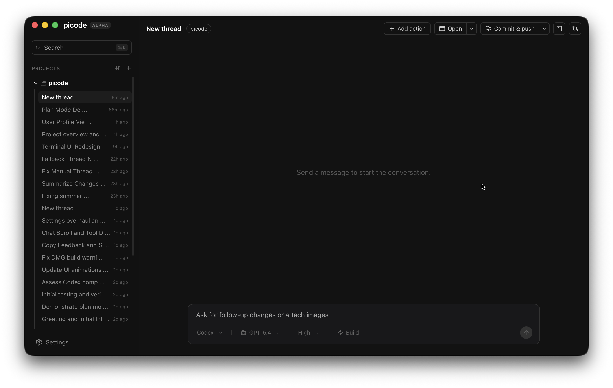

# Picode




Picode is a minimal desktop GUI for coding agents using Pi.

Built with Tauri v2, React, and TypeScript, it provides a native shell for managing your agents and projects.

## Install

Download the latest macOS DMG from the [latest GitHub release](https://github.com/VOID229/picode/releases/latest), open it, and drag `picode.app` into Applications.

Picode is currently unsigned. If macOS says the app is damaged, cannot be opened, or is from an unidentified developer, remove the quarantine attribute after installing it:

```bash
xattr -dr com.apple.quarantine /Applications/picode.app
```

Linux support exists in the codebase but is not refined yet. There are currently no polished Linux installations such as `.rpm`, `.deb`, or AppImage packages; Linux is source-build only for now.

On Linux, you need the following dependencies:

- cc
- libglib2.0-dev
- libgtk-3-dev
- Rust (and recommended to run `rustup default stable`)
- Bun

## Features

- projects and threads management
- Git context and local project state
- Uses a system-installed `pi` CLI over official RPC mode
- macOS DMG packaging
- Experimental Linux source builds

## Providers

Picode uses Pi as the backend which can connect to:

- Codex
- Claude
- Gemini
- OpenCode
- Ollama
- LM Studio
- And more...

## Local Development

Install the required tooling first:

- Bun
- Rust
- Tauri prerequisites for your OS
- A system-installed Pi CLI

Install Pi globally and complete its login/config flow:

```bash
bun add --global @mariozechner/pi-coding-agent
pi
/login
```

Install dependencies:

```bash
bun install
```

Run the desktop app:

```bash
bun run tauri:dev
```

Run only the web UI:

```bash
bun run dev
```

## Build

Create a production desktop build:

```bash
bun run tauri:build
```

Create a macOS DMG:

```bash
bun run dmg
```

Current release packaging:

- macOS: DMG
- Linux: not refined yet; no official `.rpm`, `.deb`, or AppImage installer is currently shipped

## Notes

Picode is still very early. Expect bugs.

App state is stored locally in the platform app-data directory.
Pi session files are stored under the app-data directory in `pi-sessions/`.

## License

Picode is licensed under the GNU Affero General Public License v3.0 only. See [LICENSE](LICENSE).
